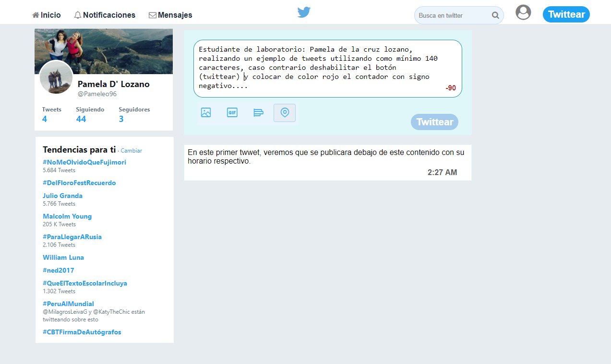

# TWITTER

Este repositorio contiene el desarrollo de maquetacion y animacion sobre la replica del newsfeed de **(Twitter)** poniendo en práctica lo aprendido en clases y el self learnig estructuras HTML, hoja de estilo CSS y utilizando DOM para realizar (animaciones mediante uso de eventos).
- La pagina a replicar es: [página original](https://twitter.com/).

# Flujo de trabajo: Trabajaremos mediante versiones:

## Versión 0.0.1

1. Diseñar un formulario que permita ingresar un texto y un botón para `"twittear"`.
2. Agregar un `evento de click al botón` o de submit al formulario.
3. En el evento, obtener el texto.
4. Agregar el texto al HTML.

## Versión 0.0.2

1. No ingresar texto vacío `(deshabilitar el botón de "twittear")`.
2. Contar la cantidad de caracteres de `forma regresiva`.

## Versión 0.0.3

1. Si pasa los 140 caracteres, `deshabilitar el botón`.
2. Si pasa los 120 caracteres, mostrar el contador con OTRO color.
3. Si pasa los 130 caracteres, mostrar el contador con OTRO color.
4. Si pasa los 140 caracteres, mostrar el contador en negativo.

## Versión 0.0.4

1. Al presionar enter(/n) que crezca el textarea de acuerdo al tamaño del texto.

## Versión 0.0.5 (Extra)

1. Si la cantidad de caracteres ingresados (sin dar un enter), supera al tamaño del textarea por defecto, debe de agregarse una línea más para que no aparezca el scroll. (Si en caso aplica)

## Versión 0.0.6 (Extra)

1. Agregar la hora en que se publicó el tweet. `En el formato de 24 horas: hh:mm`.

### Herramientas Utilizadas:
1. HTML5
2. CSS3
3. JS 

## PRODUCTO FINAL
El reto consiste en replicar el newsfeed de Twitter

 